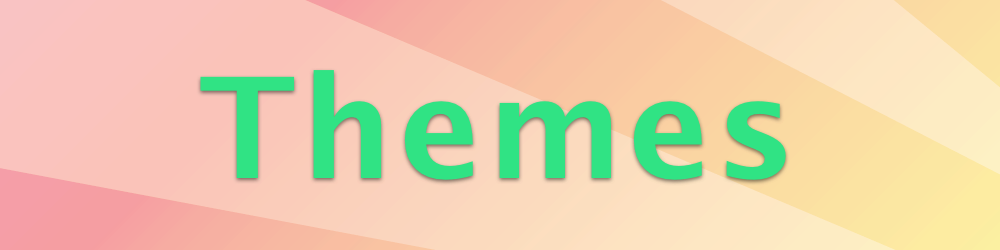

# Themes

[](https://travis-ci.org/onmyway133/Themes)
[](http://cocoadocs.org/docsets/Themes)
[](https://github.com/Carthage/Carthage)
[](http://cocoadocs.org/docsets/Themes)
[](http://cocoadocs.org/docsets/Themes)





<div align = "center">


</div>

## Story

Ever want to support Night mode? Or skin the app differently depending on the seasons? Or toggle features according to paid status? Well, those are actually reactions to app events.

Many other frameworks encourage you to use hard coded values, like `label.xyz_textColors = [.red, .blue], textField.xyz_fonts = [font1, font2], ...`. This also makes it very hard to change because the usage of index, you need to remember that the 1st index is this theme, the 2nd index is that theme, ... Also, `xyz_textColors` is like trying to replicate the entire `UIKit` APIs, which updates often :scream:

**Themes** is here to help. Usually, you have a finite number of colors and fonts in an app. You can have many more but that is not encourage and has design smells. When you have a theme, changing happens in one place. 

## Features

- [x] Universal support for iOS, macOS, tvOS, watchOS
- [x] Complete control over themes
- [X] Update existing views
- [x] Protocol oriented
- [x] Extensible

## Usage

### Step 1: Create a theme

Create your theme by conforming to `Theme`, which is just a marker protocol. You can declare whatever you like, including nested objects, all depending on your need. You can also create as many themes as you like

```swift
struct MyTheme: Theme {
  let topImage: UIImage
  let cellColor: UIColor
  let backgroundColor: UIColor
  let name: String
  let titleFont: UIFont
  let subtitleFont: UIFont
}
```

Then list all your themes in a place, for example

```swift
struct MyThemeList {
  static let dayTheme = MyTheme(topImage: UIImage(named: "day"), cellColor: .white)
  static let nightTheme = MyTheme(topImage: UIImage(named: "night"), cellColor: .black)
}
```

The beauty of this is that you can `init` your theme from json, which can be fetched from backend :rocket:

```swift
let json = [
  "primary_color": "#21ABE9",
  "font_name": "Chewy"
]
let unicornTheme = MyTheme(json)
```

### Step 2: Register your current theme

When app launches, you need to declare 1 theme as the current, it can be loaded from cache

```swift
ThemeManager.currentTheme = dayTheme
```

### Step 3: React to theme change

You can do this wherever you like. It is set using the current theme, and whenever theme changes

```swift
// ViewController.swift
override func viewDidLoad() {
  super.viewDidLoad()

  use(MyTheme.self) {
    $0.title = $1.name
    $0.tableView.backgroundColor = $1.backgroundColor
    $0.navigationController?.navigationBar.setBackgroundImage($1.topImage, for: .default)
    $0.tableView.rowHeight = $1.name == "Unicorn" ? 180 : 120
    $0.tableView.reloadData()
  }
}

// Cell.swift
override func awakeFromNib() {
  super.awakeFromNib()

  imageView.layer.cornerRadius = 5
  imageView.layer.masksToBounds = true

  use(MyTheme.self) {
    $0.titleLabel.font = $1.titleFont
    $0.subtitleLabel.font = $1.subtitleFont
    $0.container.backgroundColor = $1.cellColor
  }
}

```

### Step 4: Change the theme

Change the current theme is as easy as assigning a new theme. All happens in real time and very fast

```swift
ThemeManager.currentTheme = nightTheme
```

## Installation

**Themes** is available through [CocoaPods](http://cocoapods.org). To install
it, simply add the following line to your Podfile:

```ruby
pod 'Themes'
```

**Themes** is also available through [Carthage](https://github.com/Carthage/Carthage).
To install just write into your Cartfile:

```ruby
github "onmyway133/Themes"
```

**Themes** can also be installed manually. Just download and drop `Sources` folders in your project.

## Author

Khoa Pham, onmyway133@gmail.com

## Contributing

We would love you to contribute to **Themes**, check the [CONTRIBUTING](https://github.com/onmyway133/Themes/blob/master/CONTRIBUTING.md) file for more info.

## License

**Themes** is available under the MIT license. See the [LICENSE](https://github.com/onmyway133/Themes/blob/master/LICENSE.md) file for more info.
